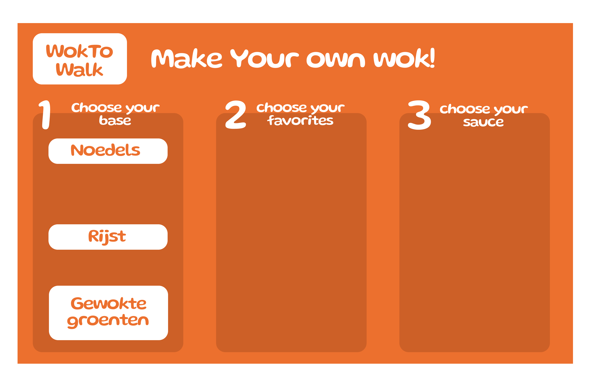
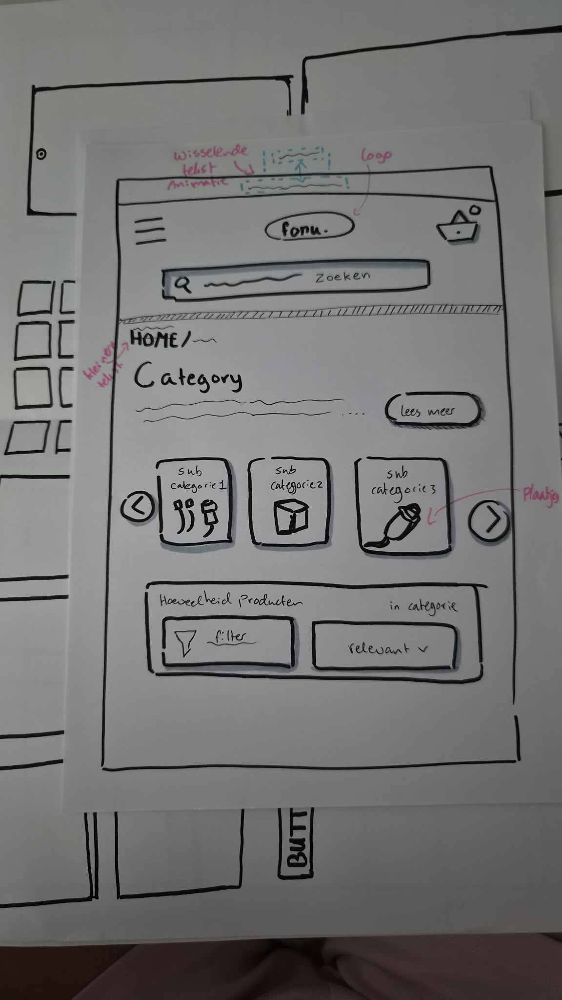
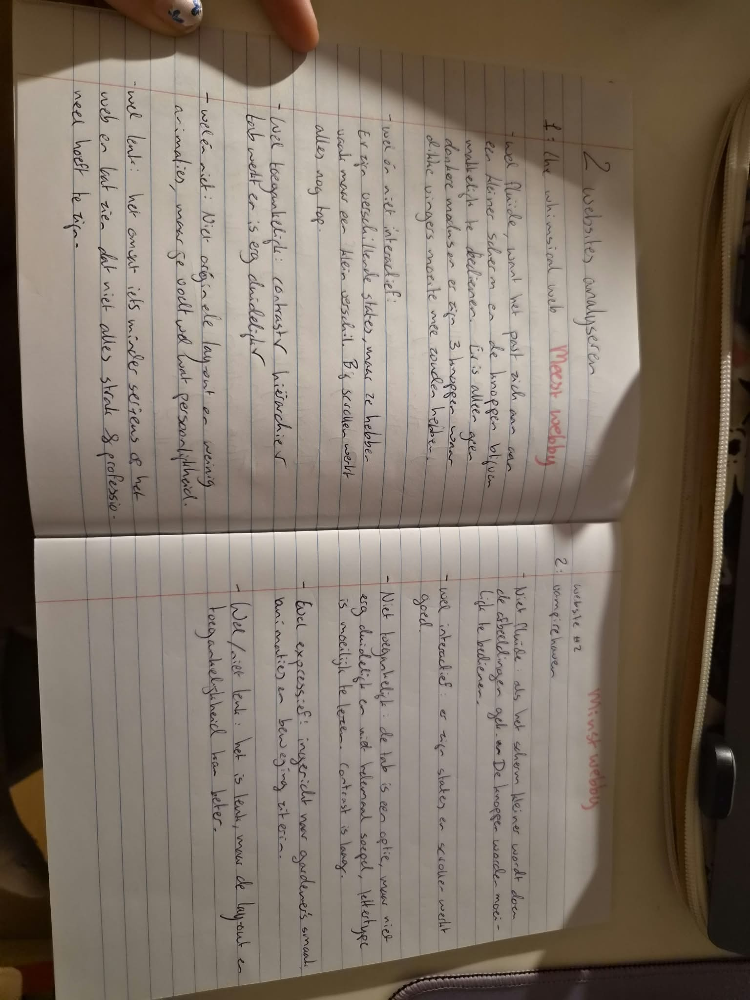
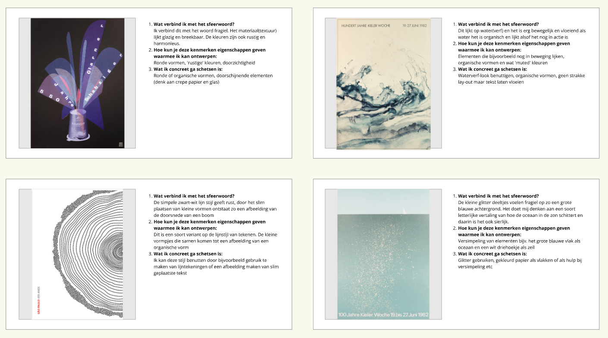
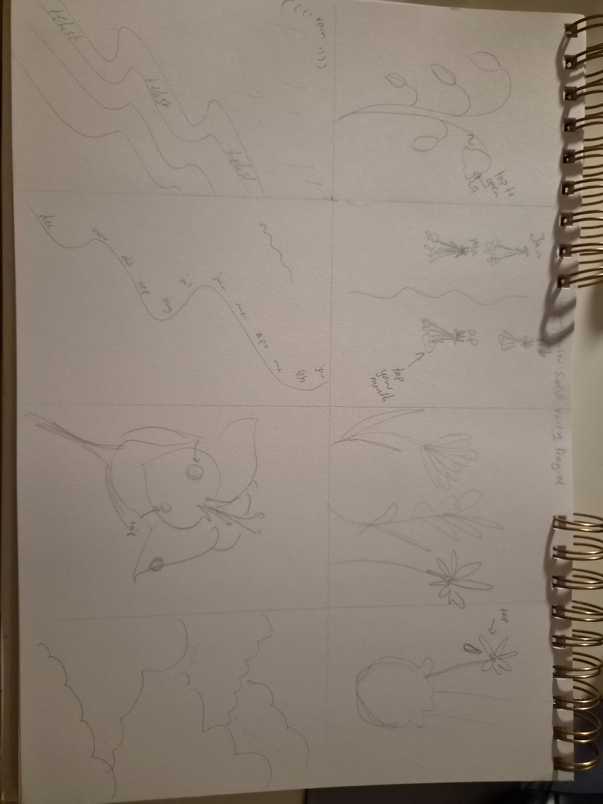
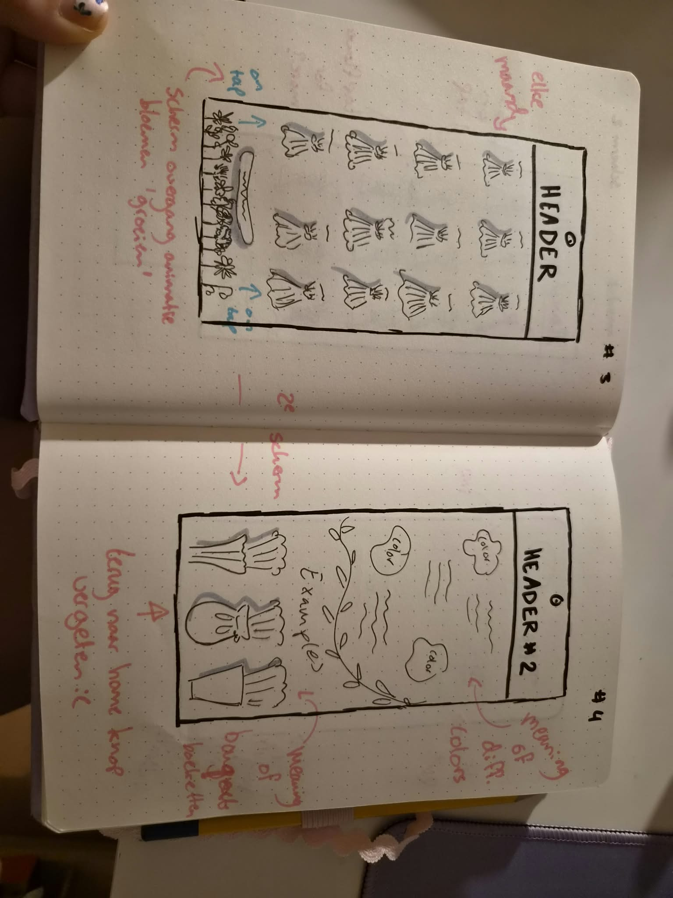
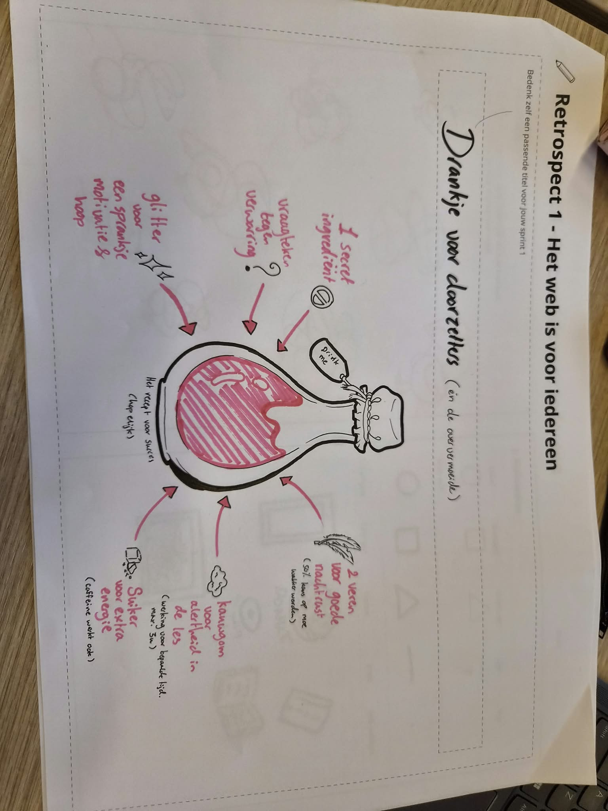
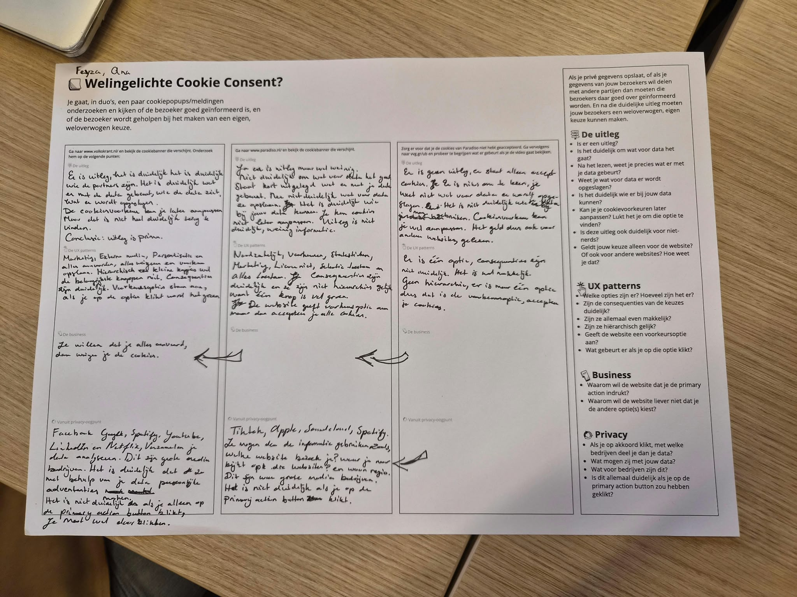

# Model

Het staat model voor digitale tuintjes welke bij 'Het web is voor iedereen' door studenten worden gemaakt.

## Learning Log

###

31 AUG - START
vragen:

1. Leg uit wat een source hosting platform is en voor welke jij gekozen hebt: Ik heb gekozen voor codeberger, Het host jouw website en is een soort backup
2. Vertel welke domeinnaam jij gekozen hebt en hoe je die hebt gekoppeld aan jouw pagina: F3ysgarden.nl, ik heb mijn domeinnaam nog niet gekoppeld, maar daarvoor gebruik ik transIP en denk ik dat ik het link aan mijn URL
3. Beschrijf hoe je aanpassingen aan jouw pagina kunt maken en hoe je er voor zorgt dat die op het web gepubliceerd worden: Je maakt aanpassingen in de code die je moet opslaan en committen. Je hebt het origineel en daar maak je eigenlijk aanpassingen.

2 SEPTEMBER

Ik heb MMD en micro interacties herhaald. Ik ben aan de slag gegaan in figma om een wok to walk menu te maken. Ik heb het niet helemaal afgekregen, maar ik had wel een goed idee in mijn hoofd waarbij ik deze elementen gebruikte. 5 elementen:
-Cues
-Feedback
-Feedforward
-Prompts
-Affordance
De opdracht was bedoelt om ons na te denken over verschillende formulieren en hoe je een overzichtelijk formulier kan ontwerpen.

Ik heb ook een deep dive gehad over schetsen en wireframes. Hierbij begonnen we met het oefenen van lijnen en vervolgens hebben we een website uitgekozen en hier een wireframe van gemaakt. Hierbij herhaalde we dingen als hoe je animaties schetst (blauwe stippellijnen bijv.) of hoe je knoppen duidelijk maakt in een schets. Hier zie je mijn wireframe:

4 SEPTEMBER
Deep dives: Praktische CSS en HTML en CSS basics:
Bij de HTML en CSS basics werd herhaald hoe het allemaal ook alweer werkt en ook een stukje 'geschiedenis' over welke personen er eigenlijk achter zitten. Het werd weer duidelijk gemaakt hoe HTML de content/basis is (marked-up content) en CSS de echte styling ervan is. JS wordt dan gebruikt voor de interactieve/bewegende elementen.

Bij praktische CSS gingen we zelf een lelijke website transformeren tot een duidelijke mooie website en was het een herhaling bij formatting. We hadden wel het één en ander gedaan dat ik niet helemaal snapte.

### Sprint 1

~SPRINT 1~
MA 7-09: Ik was deze dag niet aanwezig, dus het volgende is zelfstandig gedaan:

OVER MIJN GARDEN:
-Inventarisatie: Ik zou zelf iets willen maken wat ik interessant vind en waar ik blij van word. Ik had bij een website gezien dat mijn cursor veranderde naar een hartje, het lijkt me erg cool om ook zoiets te kunnen gebruiken en personaliseren. Ik zag ook dat je ergens op kon klikken en dat er dan confetti en een geluidje afspeelde.

-Toon/content: Mijn idee nu is een website over geboortebloemen en hoe dit bepaald wordt/de betekenis van die bloemen. De toon die ik wil is rustgevend en uitnodigend.

-Content van anderen: Ik probeer zoveel mogelijk content van mezelf te gebruiken qua handgetekende afbeeldingen etc. Ik heb wel bronnen nodig voor de informatie en af en toe een afbeelding. Ik zoek naar echte bronnen (GEEN AI!! ik ben tegen AI) en link deze volgens APA bronvermelding.

-Ervaring: Ik wil gebruik maken van verschillende vormen van gebruik, waar ik nu bijvoorbeeld aan moet denken is dat er white noise/brown noise in de achtergrond speeld en dat de gebruiker controle heeft over wat voor audio (of geen)

Ik heb ook zelfstandig websites geanalyseerd en gerangschikt a.d.h.v het formulier:

Ik heb een collage gemaakt van inspirerende afbeeldingen:

En links verzameld van nuttige bronnen over mijn onderwerp: 1.https://weeklyflower.nl/bloemenbibliotheek/geboortebloem-maand/ ->Dit geeft een handig overzicht over
bij welke maand welke bloem hoort. 2.https://www.fiestajewellery.nl/blogs/blog/waarom-heeft-elke-maand-een-eigen-geboortebloem -> Hier werd het victoriaanse tijdperk benoemd, waardoor ik door ben gaan zoeken naar bronnen hierover. 3.https://vertaalbureau-scandic.nl/victoriaanse-taal-van-bloemen-wat-betekenen-ze/ Dit artikel gaat echt in op de taal van de bloemen (niet alleen die uit de maanden) inclusief wat verschillende kleuren betekenen, vanuit het vctoriaanse tijdperk. 4.https://floriografie.nl/category/geboortebloemen/ Dit artikel geeft echt een uitleg over waarom
deze bloem word gekoppeld aan deze maand. 5.https://anilens.com/product/houten-schijf-met-geboortebloemen-26cm/ Visuele representatie van twee bloemen per maand 6.https://nl.wiktionary.org/wiki/bloementaal dit is een leuk stukje over de betekenis van het woord 7.https://nl.jardineriaon.com/floriografie.html Dit gaat dieper in op de geschiedenis en andere aspecten 8.https://flowerslib.com/nl/bloementaal/ Een soort woordenboek voor bloemen 9.https://zodiacstock.com/zodiac/zodiac-flower-chart nog een mooi overzicht, twee per maand 10.https://www.homefortheharvest.com/lily-of-the-valley/ Tot slot - mijn geboorte bloem

CHECK OUT - MAANDAG 07-09
1.Wat is het verschil tussen een digitaal tuintje en anders dan reguliere websites?
Voor mij zit het verschil erin dat het digitaal tuintje nooit echt 'af' gaat zijn zoals vaak wel het doel is bij een reguliere website (Website ontwerpen, alles werkt, en klaar) jij blijft leren en daarmee toevoegen aan je digitaal tuintje die zo steeds verder kan groeien. Het is ook iets persoonlijker, wat meer naar jezelf gericht dan het publiek.

2.Een website is 'webby' wanneer het vloeiend kan werken en niet ineens gek gaat doen als je je scherm kleiner maakt of op donkere modus zet, als de toegankelijkheid in het achterhoofd wordt gehouden.

3.Mijn idee voor mijn digital garden ligt nu bij informeren over jouw geboorte bloem(en) en over bloementaal wanneer het aankomt op boeketten. Ik wil een soort rustige interesse opwekken die niet saai wordt en waar je even kan ademhalen?

[WOENSDAG 09-09

Ik heb gekeken naar een presentatie van iemand uit een andere klas over Amsterdam en een beetje feedback hierop gegeven. Mijn eigen presentatie was nog niet helemaal af, maar ik had wel het een en ander verteld over mijn ideeën en dit samen besproken wat wel/geen goed idee was. Dit gaf me meer bevestiging over het bloemen-onderwerp.

We hebben op miro gewerkt aan visual research, waar ik een idee had over een 'fragiele sfeer'
Hier mijn posters met uitleg:

Maar ik weet nog niet zeker of ik dit wil benutten en hoe.
We hebben ook een crazy 8 oefening gedaan, waar dit uit kwam:

De tweede van linksboven spreekt mij het meeste aan.

De Visual Research bestaat uit drie stappen. De eerste stap is terug kijken naar je afbeeldingen en één of meerdere sfeerwoorden formuleren, hierbij kan je afbeeldingen zoeken en vanuit die afbeeldingen wat abstractere vormen(wij deden dus typografische posters) Dit helpt je met het vormen van een idee voor de sfeer van jouw website en wat je kan benutten om jouw informatie op deze manier vorm te geven.

Mijn garden gaat over geboorte-bloemen, de eigenschappen hiervan en de bloementaal. Ik wil ook een stukje bewaren voor bloemenboeketten met betekenis. Omdat de informatie snel erg tekstueel kan worden wil ik slim gebruik maken van beeld en geluid.

In mijn crazy 8 had ik een idee gebaseerd op gedroogde boeketten aan een muur als decoratie. Ik heb dit een paar keer voorbij zien komen op social media en het lijkt me cool om hier wat mee te doen en ook een goede vorm voor mijn onderwerp!]

VRIJDAG 11-09

Voor vandaag heb ik vanuit mijn crazy 8 wat mobile-first schermen geschetst. Ik nam voornamelijk de tweede van linksboven als uitgangspunt.

Van deze vijf schetsen waren deze twee mijn uitgangspunten die het beste bij mijn idee pasten.
Ik had ook een voortgangsgesprek, waarin mijn ideeën waren goedgekeurd en ik aan de slag kon met het bepalen van mijn content en een begin kon maken aan mijn HTML-structuur. Het advies van de student-assistent was het gebruik maken van een list voor de maanden.

[MA 14-09

Ik heb tijdens het weekend gewerkt aan mijn HTML-structuur, maar nog niet echt aan de CSS, omdat ik niet wist waar ik moest beginnen.

Ik heb ervoor gekozen de maanden in een lijst te zetten en de hoofdpagina simpel te houden met weinig andere input, voor een rustiger uiterlijk:

<h2>Kies jouw geboortemaand</h2>
      <nav>
        <ol>
          <li><a href="Jan.html">Jan</a></li>
          <li><a href="feb.html">Feb</a></li>
          <li><a href="mar.html">Mar</a></li>
          <li><a href="apr.html">Apr</a></li>
          <li><a href="mei.html">Mei</a></li>
          <li><a href="jun.html">Jun</a></li>
          <li><a href="jul.html">Jul</a></li>
          <li><a href="aug.html">Aug</a></li>
          <li><a href="sep.html">Sep</a></li>
          <li><a href="okt.html">Okt</a></li>
          <li><a href="nov.html">Nov</a></li>
          <li><a href="dec.html">Dec</a></li>
        </ol>
      </nav>
En ik heb een goed begin gemaakt aan mijn CSS door een light en dark theme in te stellen en de lijst in een grid te zetten, zodat ik het kon manipuleren hoe ik wilde.

CHECK OUT

Leg uit wanneer een website 'lelijk' wordt: Als je geen CSS hebt gebruikt, dus bijvoorbeeld geen fonts, plaatjes die te groot zijn of een lay-out die niet in je scherm past of niet responsive is.

Vertel welke volgende stap je neemt om je website responsive te maken: Ik ben nu bezig met mijn light/dark theme uit te werken met de toggles en ik werk nog aan mijn gelinkte pagina's.

Kun je het ontwerp en de bouw van je eigen Garden (zo uit je hoofd) onderbouwen in Webby vocabulair?: Julius zegt van niet. Ik weet wel de termen fluïde en toegankelijkheid, maar ik weet niet al het vocabulair uit mijn hoofd. Ik heb wel al een beetje gewerkt aan de focus states van mijn links, waardoor die toegankelijker zijn.]

[WO 16-09
Ik heb verder aan mijn CSS gewerkt en gekeken naar gestalt principes in mijn ontwerp, hoewel dit nog niet perfect is. Ik heb veel gebruik gemaakt van custom properties en nieuwe manieren ontdekt om individuele list-items te stylen. Op deze manier:

li:nth-of-type(2) {
background-image: url("febviool.png");
background-size: var(--background-size);
background-repeat: var(--background-repeat);
list-style: var(--list-style);
padding-inline-start: var(--padding-inline-start);
}

3 gestalt principes: nabijheid, elementen die dicht bij elkaar staan en daardoor zichzelf vormen.
Hiërarchie: Elementen een bepaalde grote of uiterlijk geven, waardoor je aandacht door een pagina heen wordt geleidt en verschillende dingen zich op zijn beurt jouw aandacht trekken.
Ingevulde hiaat: dat je in je gedachten een lege vorm aanvult

Een grid maakt het makkelijker om een mooie structuur te geven aan je website, zonder je teveel te 'restricten' zodat je er nog steeds veel mee kunt

Ik ben aan het letten op witruimte en hiërarchie in grootte van de tekst. Ik wil graag dat mijn website mooi en rustig blijft ogen, ik heb hiervoor ook een soort papier-textuur toegevoegd.]

VRIJDAG 18-09

Ik heb op donderdag een aantal afwerkingen gemaakt aan mijn website en ervoor gezorgd dat het fluïde en interactief werkt. Ik heb de laatste details van de fonts neergezet en de individuele bloemen-pagina's gecodeerd. Ik moet het wel nog door een spellingscheck gooien.

Tijdens de les hebben we gewerkt aan een retrospective, waarin we een metafoor hebben bedacht voor de sprint. Ik heb een drankje voor doorzetters (en de oververmoeide) bedacht:

CHECK OUT
ORIËNTEREN & BEGRIJPEN:

1. Waarom geven de docenten deze opdracht?
   Ik denk dat ze deze opdracht geven zodat wij meer kennis hebben op het gebied van code en dit in het werkveld
   kunnen toepassen. Ook als je het niet gaat gebruiken, kan het vaak voorkomen dat je dan in een team werkt
   met iemand die het coderen doet/kan/hierover gaat praten en het is dan handig om de basis kennis te hebben en mee te kunnen praten hierover.
2. Welke technieken gebruik ik? Ik gebruik HTML & CSS en de source hosting platform is github. Voor kleinere dingen gebruikte ik firealpaca om te tekenen en een image converter als ik een bestandje om wilde zetten.
3. Wat zijn de randvoorwaarden? Er waren best een aantal randvoorwaarden om aan te voldoen, waaronder het goed bijhouden van de learning log en het kunnen uitleggen van je ideeën, keuzes en code. Je website moet jouw intresse duidelijk weergeven en je vormgeving moet hierbij passen. Je garden moet responsive zijn, twee thema's hebben en de gestalt principes toegepast.
4. Waar gebruik je HTML en CSS voor? HTML is om je rauwe content te 'marken' Je geeft je inhoud een structuur. Met CSS stijl je deze content en maak je het 'mooi' en leesbaar en kan je het een persoonlijk tintje geven.
5. Wat kan je allemaal met CSS? Je kan echt een wereld aan verschillende dingen. Je kan verschillende layout technieken toepassen, knoppen stylen kleine interacties en volgensmij ook animaties toevoegen, custom cursors toevoegen en hoogst waarschijnlijk nog veel meer waar ik niet zoveel van weet.

VERBEELDEN & CONCEPTUALISEREN

1.  Lukt het om verschillende ideeën te bedenken?
    Ja ik heb daar niet zoveel moeite mee. Ik vind brainstorming technieken erg fijn, omdat je gewoon alles in je hoofd even opachrijft en er dan vaak best wel wat uit kan halen. De crazy 8 methode of sfeerwoorden bedenken hielpen mij ook goed om wat verder te denken.
2.  Lukt het om je ideeën te schetsen? Ja zeker. Ik hou sowieso al van tekenen, dus mijn ideeën uitbeelden vind ik erg leuk en komt er vaak wel soepel en vlot uit bij mij. Ik vind het leuk om na te denken over hoe je hetzelfde ding op verschillende manieren kan schetsen.
3.  Wat doet deze CSS property? Ik heb met verschillende CSS properties gespeeld en geprobeerd en veel de MDN website benut. Ik probeer vaak gewoon dingen en dan kijk ik wat er gebeurt. Wat me nog niet is gelukt is de custom cursor!
4.  Wat voor HTML heb ik nodig? Mijn home page bestaat eigenlijk uit een lijst van maanden. De afzonderlijke pagina's bestaan uit korte alinea's en kopjes. Elke pagina heeft een eigen afbeelding die gelijk is aan het icoontje op de lijst.
5.  Hoe kan je de content vormgeven? Ik wilde het karakter en de kleuren van de bloemen behouden, dus ik heb ze zelf getekend. Ik heb een grid gebruikt voor het lijstje zodat ze mooi in 3 kolommen staan, want onder elkaar stond het niet zo mooi. Voor de afzonderlijke pagina's heb ik gekozen voor de tekst links te houden en de afbeelding rechts, omdat we van links naar rechts lezen. Het vloeit nog steeds een beetje in elkaar over, wat mag, zodat het niet te strak oogt.
6.  Wat als ik nu ineens 1000 invul? Ik denk dat het niet helemaal leesbaar meer zou zijn, maar ik zou het opzich nog wel een stukje groter kunnen maken. Misschien moet ik dit nog is uitproberen.

PROTOTYPEN & UITWERKEN

1. Begrijpen bezoekers jouw site? Tot nu toe wel. Mijn site is best direct en simpel. Als mensen het niet meteen snappen gaan ze rond klikken en kijken wat er nog meer te zien en te lezen valt.

2. Wat vind jouw opdrachtgever ervan? Als hiermee mijn docenten bedoelt worden vinden ze het een leuk idee en de uitvoering ook best redelijk. Er zijn nog hier en daar wat punten die verbeterd kunnen worden of uitgebreider kunnen, maar het gaat de goede kant op. Als er vanuit mijn standpunt gekeken wordt ben ik er blij mee.

3. Werkt dit wel? Zeker. Ik had niet een heel moeilijk concept, omdat het niet altijd moeilijk hoeft. Mijn website was best haalbaar, ook al waren er veel nieuwe dingen die ik heb geleerd en gebruikt, naast de deep dives. Er zijn ook wat dingen die wel kunnen, maar waar ik de skills nog niet voor heb. Ik heb de basis van mijn idee al best redelijk kunnen uitwerken en het nu nog kan verbeteren/uitbreiden.

4. Kan dit ook? Ik ben erachter gekomen dat de custom cursor en CSS property is. Het is mij nog niet gelukt, maar het is zeker een doel voor volgende week om dit te verwerken in mijn ontwerp, omdat het echt wat unieks toevoegd aan mijn website. Ik was eigenlijk verrast dat niet meer websites hier gebruik van maken.

EVALUEREN

1. Wat wilde ik weten? Het grote plaatje was hoe je een website uit code schrijft, de inhoud daarvan was dat ik meer wilde weten over geboortemaanden en de bloemen hierbij.
   Wat deed ik om erachter te komen? Ik heb meerdere bronnen gezocht en doorgelezen en beoordeelt of ze betrouwbaar waren of niet en gekeken naar de autoriteit van de schrijvers.
   Wat was het resultaat? Meer kennis over het onderwerp en een basis aan kennis in coderen.
   Wat weet ik nu? Ik weet nu meer over hoe het werkt om een website vanuit de code op te bouwen en een klein beetje over source-hosting. Ik weet ook meer over bloemen, maar deze kennis kan nog ver uitgebreid worden.

2. Wat heb ik allemaal gedaan? Ik heb bronnen onderzocht, een typografisch poster onderzoek, schetsen gemaakt van mijn website vanuit een crazy 8, Ik heb een structuur opgezet in HTML en dit gestyled in CSS. Ik heb ondertussen wat opdrachten gemaakt in de les en deep dives gevolgd, tussendoor nog een paar schetsen in de les en ik heb met de hand icoontjes getekend voor mij website.

3. Wat was het resultaat? Het resultaat is, natuurlijk, mijn website. Ik heb daarnaast ook meer inzicht in wat wel en niet kan in HTML (schuldig aan het proberen van item1 of button1, wat niet leek te werken.) en nieuwe CSS properties zoals bijvoorbeeld 'nth-of-child' wat goed van pas kwam bij alle verschillende icoontjes plaatsen bij de list-items.

4. Ik heb mijn ontwerp fluïde gemaakt, maar blijkbaar niet responsive en ik weet ook nog niet precies hoe ik dat zou moeten doen. Dus dat is een voorbeeld van wat ik wel en niet weet.

5. Wat vind je wel en niet leuk? Ik vind coderen op zich wel interessant om af en toe te doen, maar ik zou hier niet mijn baan van willen maken. Zodra ik het langdurig ga moeten doen lijkt het me toch wat minder leuk. Mijn interesses liggen toch meer bij het vormgeven a.d.h.v tekeningen en illustraties.

6. Doe je nog wat je moet doen? Over het algemeen wel, alleen verlies ik de learning log wat vaker uit het zicht. Ik ben nooit zo van het bijhouden van een logboek, dus ik heb daar best wat moeite mee.

Randvoorwaarden
-HTML VALIDATIE
Als ik zo kijk ziet mijn HTML er correct en duidelijk uit. Het zou misschien slim zijn of af en toe een docent er bij te halen en te kijken of zij nog een foutje of een verbetering kunnen spotten, omdat ik er natuurlijk nog van een beginners standpoint naar kijk.

-TOEGANKELIJKHEID
Ik probeer het in gedachten te houden, maar zou dit zeker regelmatiger kunnen checken. Ik probeer de licht/donker waarden steeds wat intenser aan te passen zodat het contrast hoog genoeg is. Ik heb wel een focus state toegevoegd aan de knoppen, maar ik heb mijn website nog niet gechecked voor de spraakfunctie.

-ADAPTIEF?
Mijn website heeft en light en dark mode, maar die verschilt van de auto, omdat de achtergrond niet wordt toegepast daar en me dit nog niet gelukt is. Het past op grote en kleine schermen en wordt daarop aangepast, maar er is wel een limiet voor, want ik vind het niet erg mooi als de kolommen zo klein worden dat ze onder elkaar komen te staan. Het werkt wel nog steeds op een kleine telefoon en de opties zijn ver genoeg van elkaar af dat dikke vingers niet uit maken.

-WETOVERTREDING?
Ik heb alleen handgetekende afbeeldingen gebruikt en goed gelet op de bronnen die ik heb benut voor mijn informatie, die staan nu nog bij mijn presentatie maar ga ik snel in mijn learning log zetten. Ik denk niet dat ik de wet heb overtreden.

ZIE IK MEZELF TERUG?
Ik heb tot nu toe veel plezier gehad in het leren en maken van deze website, vooral met het tekenen sluit dit goed bij mij en mijn persoonlijkheid aan.

### Sprint 2

MA - 21-09

We hebben deze les een recap gekregen van de deepdives over coderen en dit gevolgd.

1. Wat zijn HTML landmark role elements? Het geeft de rol van een element aan in een HTML bestand.
2. Wat zijn heading elementen en hoe horen ze genest te worden? Heading elementen zijn hoofd elementen, nesten gaat op deze manier, bijvoorbeeld: <li></li>
3. Hoe ga jij met cookies om? Ik probeer zo min mogelijk cookies te accepteren en websites te vermijden die me proberen te dwingen cookies te accepteren. Na het onderzoek tjdens de les ga ik hier zelfs nog wat beter op letten.

WOENSDAG 23-09

We hebben het tijdens een lezing over privacy gehad. Ik heb hierna een website geanalyseerd over dark patterns en een oplossing hiervoor bedacht. Vervolgens heb ik nagedacht over mijn eigen 'cookies', wat dit zou inhouden en hoe ik dit zou kunnen vormgeven:

(afbeelding)

CHECK OUT WO

Wat is een wireflow en wat heb je er aan?
Een wireflow laat zien hoe je een website kan navigeren, het gaat dus elk scherm langs dat je ziet als je een knop of actie uitvoert.

Wat zijn dark UX patterns? Geef drie voorbeelden...
Bijvoorbeeld scarcity, wat inhoud dat een item heel zeldzaam wordt gemaakt om je te pushen om het bijvoorbeeld te kopen.
Je kan ook denken aan visual interference, waar ze je iets laten geloven of iets proberen voor te doen door middel van vormgeving.
Je hebt ook nagging, dat een optie heel veel in je gezicht wordt geduwd en door je strot gedouwd (pardon my french) zodat je toegeeft aan wat zij willen

Waar moet je als ontwerper rekening mee houden bij het maken van een human consent component?
Best een heleboel, denk aan duidelijk taalgebruik. Het moet ook overzichtelijk blijven en niet iemand doodgooien met niet-echt-nuttige info zodat ze geneigd zijn het niet te lezen. De opties moeten neutraal zijn (geen voorkeursoptie) en allemaal even toegankelijk. Het moet niet eindeloos lang zijn en duidelijk terug te vinden om je opties aan te passen, het kan ook handig zijn om de consequenties duidelijk neer te zetten(wat gebeurt er als je accepteerd, maar ook wat er gebeurt als je het weigert). Dit is een goed begin voor een duidelijk consent component die je zo redelijk mogelijk houdt.
